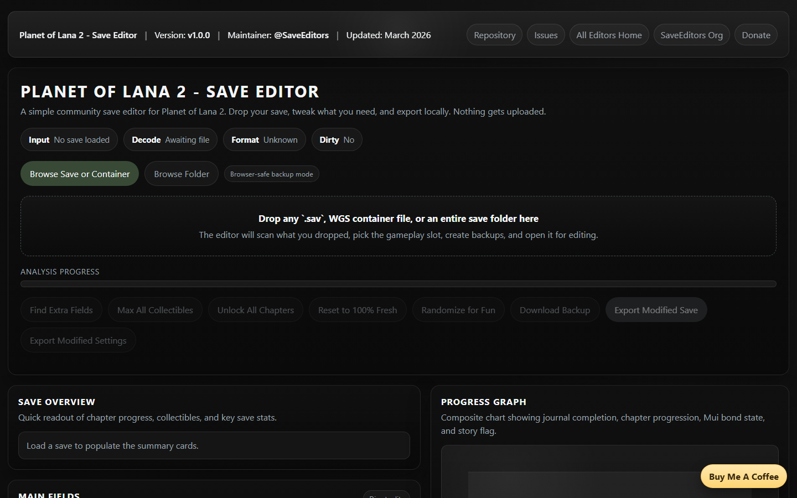

# Planet of Lana 2 - Save Editor

  

A friendly save editor for `Planet of Lana II: Children of the Leaf` that runs locally in your browser or desktop shell.

Use editor without downloading [HERE](https://saveeditors.github.io/planet-of-lana-2-save-editor/)

All editors homepage: [`https://saveeditors.github.io/`](https://saveeditors.github.io/)

Have a request for a new save editor? [Request it here!](https://whispermeter.com/message-box/15b6ac70-9113-4e9c-b629-423f335c7e07)

## What You Can Edit Right Now

- Story progression: current chapter, current scene, and record chapter/scene values.
- Position data: current and record map coordinates (`x/y`) through fields and draggable map markers.
- Journal progression: known journal GUID entries, objective marker GUID, and GUID payload list editor.
- Mui bond/progression: the full parsed Mui boolean progression array.
- Core slot stats: playtime, deaths, timestamp, story flag, version, slot index.
- Runtime settings (when `settings` file is present): debug/menu related toggles, input sensitivity/deadzone, graphics flags, locale/UI mode.

## Not Confirmed / Not Exposed Yet

- Coins, currency, XP, or level-up economy systems are not currently mapped in this game’s save format here.
- A standalone inventory class is not confirmed yet; progression is currently driven mostly by journal GUID payload + Mui array + mapped slot/story fields.
- Unknown byte regions are shown for research but kept out of normal editing.

## Quick Start (PowerShell)

Run from this folder:

- Browser mode: `./Start-PlanetLana2SaveEditor.ps1 -Mode web`
- Electron mode: `./Start-PlanetLana2SaveEditor.ps1 -Mode electron`
- Build portable EXE: `./Start-PlanetLana2SaveEditor.ps1 -Mode build`

Optional:

- Change port: `./Start-PlanetLana2SaveEditor.ps1 -Mode web -Port 9000`
- Do not auto-open browser: `./Start-PlanetLana2SaveEditor.ps1 -Mode web -NoOpen`

## Save Paths (Windows)

- Steam: `%USERPROFILE%\AppData\LocalLow\Wishfully\Planet of Lana 2\*.sav`
- Game Pass / Microsoft Store: `%LOCALAPPDATA%\Packages\<Planet of Lana II package family>\SystemAppData\wgs\`

## Notes

- Browser backups/exports are download-based due browser sandbox limits.
- Desktop mode can write backups beside the source save.
- Unknown fields stay intentionally conservative until they are validated.

What this does not do yet: it does not expose unsupported fields without stable mapping and safe write validation.

