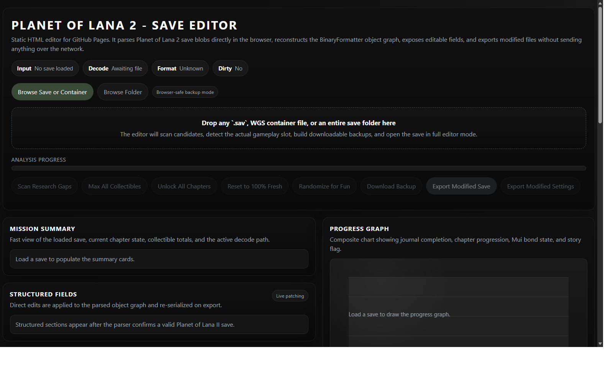

# Planet of Lana 2 - Save Editor

Browser-first save editor for `Planet of Lana II: Children of the Leaf`.

This project is meant to feel simple and friendly:
- load a save or save folder
- change known values with clear labels and help text
- export modified save + backup downloads in browser mode
- optionally run the same UI in Electron for native file access

Project checklist: see [`TODO.md`](TODO.md).

All editors homepage: [`https://saveeditors.github.io/`](https://saveeditors.github.io/)

## Project files

- `index.html`: Main app (single file, GitHub Pages friendly)
- `main.js` / `preload.js`: Electron wrapper around the same app
- `package.json`: Desktop scripts/build config
- `Start-PlanetLana2SaveEditor.ps1`: One-command launcher (`web`, `electron`, `build`)

## Quick start (PowerShell)

Run from this folder:

- Browser mode: `.\Start-PlanetLana2SaveEditor.ps1 -Mode web`
- Electron mode: `.\Start-PlanetLana2SaveEditor.ps1 -Mode electron`
- Build portable EXE: `.\Start-PlanetLana2SaveEditor.ps1 -Mode build`

Optional:

- Change port: `.\Start-PlanetLana2SaveEditor.ps1 -Mode web -Port 9000`
- Don’t auto-open browser: `.\Start-PlanetLana2SaveEditor.ps1 -Mode web -NoOpen`

## GitHub Pages

Use this folder as the repo root. No machine-specific paths are required.

- Browser backups/exports are downloads (browser sandbox limitation).
- Electron mode supports native dialogs and in-place backup writes.

## Default save paths (Windows)

- Steam: `%USERPROFILE%\AppData\LocalLow\Wishfully\Planet of Lana 2\*.sav`
- Game Pass / Microsoft Store: `%LOCALAPPDATA%\Packages\<Planet of Lana II package family>\SystemAppData\wgs\`

Package-family folder names vary per Store install, so the editor accepts any dropped file/folder and auto-detects candidates.

## Format coverage

Current parser coverage includes:
- `PoL.Progress.GameplaySlot`
- `PoL.Progress.GameplayLocation`
- `PoL.Progress.GameplayJournal`
- `PoL.Progress.GameplayPetMui`
- `System.Collections.Generic.List<string>`

## Inventory and GUIDs

There is no confirmed standalone inventory class yet in the current save set.  
Inventory-like progression is currently driven by:
- journal GUID payload (`List<string>`)
- Mui progression array
- mapped story/progress fields

The app resolves known GUIDs into readable labels and keeps unknown data clearly marked.

## Settings support

If your drop includes a `settings` payload, the app unlocks a Runtime Settings panel and preserves prefix/suffix bytes when exporting.

## Notes

This editor is intentionally conservative: mapped fields are editable, unknown bytes stay research-only until verified.
